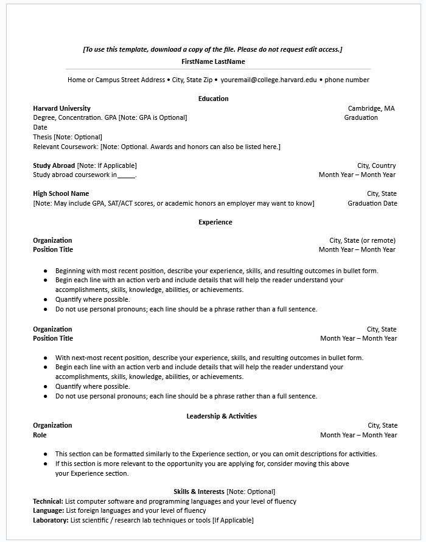
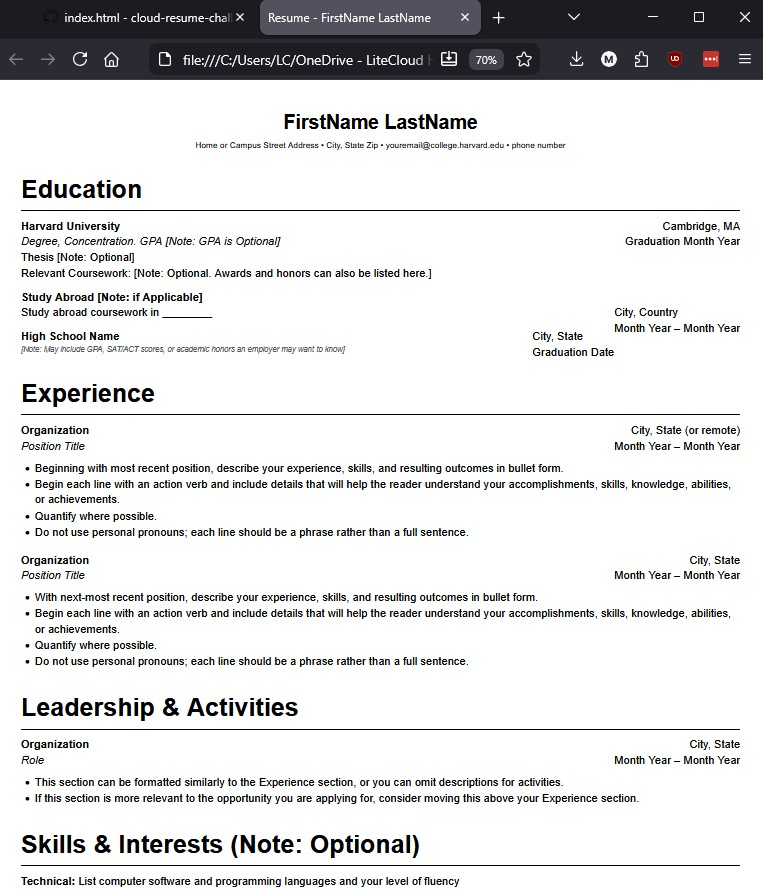

# Frontend Technical Specification

- Create a static website that serves an html resume.

## Resume Format Considerations

I live in the United States and resumes in Word/PDF format typically exclude certain information (ex - age, personal photo, GPA grades).

I'm going to use the [Harvard Resume Template](https://careerservices.fas.harvard.edu/resources/bullet-point-resume-template/) format as the basis of my resume.

### Harvard Resume Format Generation

I'm using GenAI to do the heavy lifting and generate the HTML and possibly CSS.  From there, I will manually tweak the code to achieve my desired results.

Prompt to Grok:

```text
Convert this resume format into html.
Please don't use a css framework.
Please use the least amount of css tags.
```

Image provided to LLM:


[This](./docs/nov-24-2025-resume.html) is the generated output which I will adjust.

This is what the generated HTML looks like unaltered:



## HTML Adjustments

- UTF-8 will support most languages.  I am using English.
- Because we will be applying mobile styling to our website, we'll include the viewport meta tag width=device-width so mobile styling scales normally.
- We'll extract our styles into its own stylesheet after we are happy with our HTML markup
- We'll simlify our HTML markup css selectors to be as minimal as possible.
